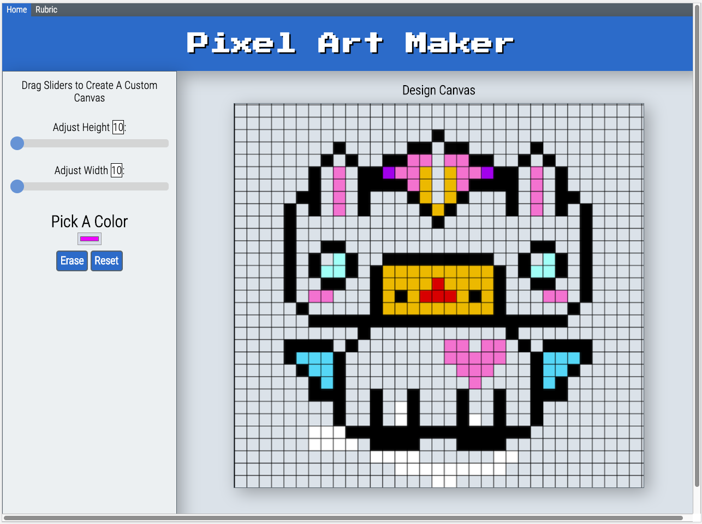

# Pixel-Art-Maker
## A single-page web app that allows users to draw pixel art on a customizable canvas   

### Grow With Google Challenge Scholarship 
### Udacity Front End Web Developer Nanodegree Project 3   

   

## Summary:
Pixel Art Maker is a pixel art painting app written in JavaScript code that lets the user create a grid of squares representing their design, and apply colors to those squares to create a digital masterpiece!   

Users can:   

1. Dynamically set the size of the table as an _N_ by _M_ grid.   
2. Choose a color.   
3. Click a cell in the grid to fill that cell with the chosen color.
4. Drag the pointer to fill multiple cells.  
5. Double click to erase the color in a single cell.
5. Click a button to erase all of the colors on the grid.
6. Click a button to reset the grid.

## Purpose:
This web app is built as project of the Udacity Front End Web Developer Nanodegree.

## Getting Started:
### Clone or fork repository
Download or clone the repository and use the terminal to navigate to the project folder.   
(https://github.com/SoCalChristina/pixel-art-maker)   

Run the project folder through a simple local HTTP server. To run the server on Python 3.x, the command is: -m http.server 8000

### npm install -g serve
To run the server on npm, the command is: npm install -g serve   
Navigate into the build directory and run the following command: serve -p 8080

### serve -p 8080
Use the most recent versions of Google Chrome or Firefox then open your browser and navigate to http://localhost:8000 or http://localhost:8080.   

### View webpage
You may also see this app at  (https://socalchristina.github.io/pixel-art-maker/).

## Attributions
### This project utilizes the following:

* JavaScript (https://www.javascript.com/)   
* JQuery (https://jquery.com/)   
* Font Awesome (https://fontawesome.com/)
* Bootstrap (https://maxcdn.bootstrapcdn.com/bootstrap/3.4.0/css/bootstrap.min.css)
* Press Start 2P font (https://fonts.googleapis.com/css?family=Press+Start+2P)
* Roboto Condensed font (https://fonts.googleapis.com/css?family=Roboto+Condensed:300)

## References
All resources are cited here and/or in the code.
* Udacity Start Code (https://github.com/udacity/project-pixel-art-maker-starter)   
* Responsive Topnav (https://www.w3schools.com/howto/howto_js_topnav_responsive.asp)
* Range Sliders (https://www.w3schools.com/howto/howto_js_rangeslider.asp)
